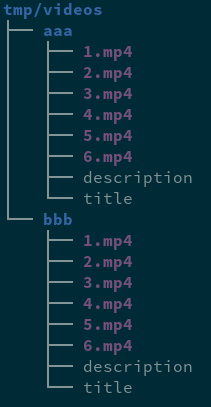

- Setup python

```bash
$ virtualenv -p /usr/bin/python3 tmp/local/python
$ source tmp/local/python/bin/activate
$ pip install pyzmq bottle
$ pip install google-api-python-client google-auth google-auth-oauthlib google-auth-httplib2
$ pip install toml pysnmp
```

- Setup snmp

```bash
$ net-snmp-config --create-snmpv3-user -ro -A "aaaaaaaa" -X "" guest
```

- Upload videos


